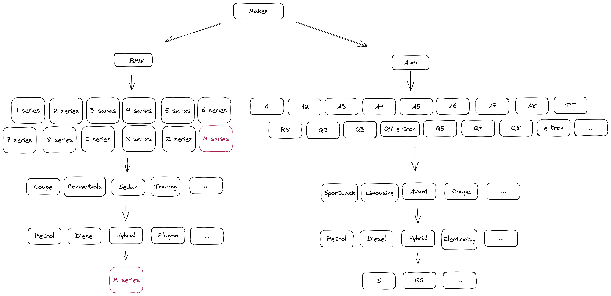
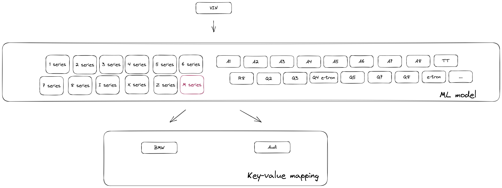
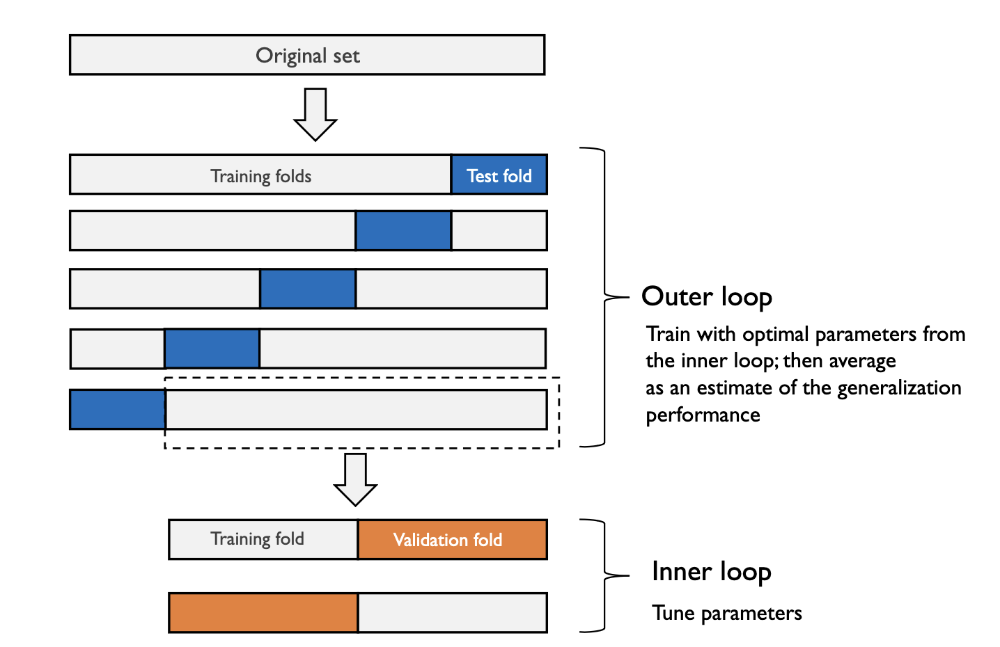

## Introduction

### Installation

We need to install `python 3.10.9` and create virtualenv.

The recommended way to do so is to use [pyenv](https://github.com/pyenv/pyenv) to manage python versions and [poetry](https://python-poetry.org/docs/) to install and manage python dependencies as well as build virtual environments and package your code.

__N.B.__ it's better to install `poetry=1.4.0` by running
```bash
curl -sSL https://install.python-poetry.org | python3 - --version 1.4.0
```
and then adding it to your `PATH`.

Once the aforesaid tools are installed, we can run the following commands to install the necessary python version:

```bash
make python
```
Now let's build a virtual environment to isolate dependencies from the packages in the base environment:

```bash
make env
```
That's it!

### ML pipeline
```bash
python vin_decoder/main.py extract-data
python vin_decoder/main.py validate-data
python vin_decoder/main.py preprocess-labels
python vin_decoder/main.py optimize-train-model --experiment-name="baseline_vin_decoder"
python vin_decoder/main.py predict-vehicle-model --vin="WBAFW11000DUXXXXX"
```

### MLflow
```bash
mlflow server -h 0.0.0.0 -p 8000 --backend-store-uri $PWD/stores/model
```

### REST API

```bash
uvicorn app.catboost_app:app --host 0.0.0.0 --port 8000 --reload --reload-dir vin_decoder --reload-dir app  # dev
gunicorn -c app/gunicorn.py -k uvicorn.workers.UvicornWorker app.catboost_app:app  # prod
```

### Docker
```bash
docker build -t vin_decoder:latest -f Dockerfile .
docker run -p 8000:8000 --name vin_decoder vin_decoder:latest
```

#### Curl

```bash
curl -X 'POST' \
  'http://localhost:8000/predict' \
  -H 'accept: application/json' \
  -H 'Content-Type: application/json' \
  -d '{
  "vins": [
    {
      "vin": "WAUZZZ8T39A0XXXXX"
    },
    {
      "vin": "WAUZZZ4G0BN0XXXXX"
    }
  ]
}'
```

#### Request URL

```
http://localhost:8000/predict
```

##### Response body
```bash
{
  "message": "OK",
  "method": "POST",
  "status-code": 200,
  "timestamp": "2023-04-30T12:37:13.079220",
  "url": "http://localhost:8000/predict",
  "data": {
    "vins": [
      "WAUZZZ8T39A0XXXXX",
      "WAUZZZ4G0BN0XXXXX"
    ],
    "predictions": [
      "A5",
      "A6"
    ]
  }
}
```

##### Response headers

```
content-length: 213
content-type: application/json
date: Sun,30 Apr 2023 12:37:12 GMT
server: uvicorn
```

#### Swagger UI
```bash
http://localhost:8000/docs
```


## Logic

### EDA

[notebooks/eda.ipynb](notebooks/eda.ipynb)

### Data validation

It defines the logic that checks if VIN contains consistent labels (make, model, year, body set). More information can be found in [notebooks/data_validation.ipynb](notebooks/data_validation.ipynb)

### Label preprocessing

Based on my quick research ([BMW](https://www.bmw.lt/lt/all-models.html) and [Audi models](https://www.audi.lt/lt/web/lt/models.html)) websites and urge to simplicify the task, I reduced all Audi and BMW models to the following hierarchy.



__Considerations__

- This is likely not the most accurate depiction of the reality and thus requires more time and research before going to prod. The goal is to only capture the main principles behind this workflow.
- Not sure where _BWM M series_ should fall exactly since [BMW themselves consider M series as both, as a model as well as a tier](https://www.bmw.lt/lt/all-models.html).
- Some models like _X series_, _Z series_, etc can be broken down to X2, X5, X6, thus this requires additional layer in BWM hierarchy.
- Not exactly sure how to build a hierarchy for Audi body sets and engine types, need more time and business context to improve over it.
- In general, I would look for ways to split this VIN decoding task into multiple separate classification tasks. In my experience modularity always leads to better overall system prediction accuracy as well as is much easier to maintain and improve upon from the engineering point of view.
- For instance, there could be a service that detects the make of the vehicle (regex / ML model) first, then calls a respective service (most likely just ML) that would be optimized to classify either BWM / Audi models (those would be 2 different models).
- Then vehicle model prediction service would call a service to predicts engine type and the same idea of drilling down into the hierarchy would extend to body sets, year, etc until we build the whole report.
- If possible, I would aim for completely modular and isolated services / ML models that serve only 1 function (and does this 1 function well) to ensure separation of concerns. Anything else is generaly considered as an anti-pattern, though more business context is needed before making such claims.
- With the proposal above, we will end up with a plethora of modular services that we'll need to maintain and manage. This will also introduce additional network latencies, though to my understanding, SLA requirements are not very strict, so this might not be a big problem. Once again - need more business context and domain expertise to check the validity of this.
- Some car makers are subsidiaries of the same car company so maybe they follow the same standards and maybe can be combined into 1 ML model / service (e.g. Audi, Porsche, Škoda, Seat are subsidiaries of Volkswagen)?


__N.B.__ In this assignment, I'll just focus on building just 1 machine learning model that detects the model of the vehicle from VIN (1 model for both, BMW and Audi). The same approach can be reused to building the rest of the system. The make of the vehicle can be inferred from cached key value pairs in memory key-value stores like [Redis](https://redis.io/), [DynamoDB](https://aws.amazon.com/dynamodb/) or even [Aerospike](https://aerospike.com/).

The same, but simplified hierarchy can be seen below.



More information can be found in [notebooks/label_preprocessing.ipynb](notebooks/label_preprocessing.ipynb)

### Stratified nested cross-validation

__Feature engineering__

In order to convert VINs into features (since ML does't work directly on text), we'll consider the following methods:

* One hot encoding
* Count Vectorizer
* Ngrams
* Hash Vectorizer
* TF-IDF

Some observations:

* One Hot Encoding doesn't take into consideration frequency of the token occurences as well as preceding and following tokens. The latter should presumably be important given the nature of the task.
* Count Vectorizer - don't consider preceding and following tokens. As it was mentioned, this should be very important for the VIN decoder task due to the nature of the task.
* Ngrams - takes into account unigrams, bigrams, trigrams, hence makes total sense to look into.
* Hash Vectorizer - idea is the same of Ngrams, it just applies hashing trick on top to reduce dimensionality of text features.
* TF-IDF - idea is the same of Ngrams, but additionally it weights each token based on it's frequency across all tokens. Generally tokens that appear rarely have more predictive power.

Considering comments above, we'll exclusively focus on the following methods:

* Ngrams
* Hash Vectorizer
* TF-IDF

__N.B.__ We'll treat each character as a separate token.


__Model training__

__N.B.__ We'll have to use stratified [nested cross-validation](https://scikit-learn.org/stable/auto_examples/model_selection/plot_nested_cross_validation_iris.html) framework in order to train the model!

Rationale behind the need of stratified nested CV:

* Dataset is very small
* We need to choose:
    * Best text-to-features method
    * Best hyperparameters
    * Estimate generalization performance on unseen data
* It's a [general recommendation](https://arxiv.org/abs/1811.12808) when datasets are this small
* We have to use stratified sampling of data in order to keep category distributions between training / validation / test splits as similar as possible.

Stratified nested CV:

* We'll perform a normal cross validation by spliting the given dataset into training and validation datasets multiple times (outer loops).
* Each training split from the previous cross validation will be split again into training and validation datasets (inner loops).
* We'll use inner cross validation to choose the best text-to-features method + hyperparameters combination for the given outer training / validation split
* Once the best vectorization method and hyperparam set for this outer loop is known, we'll retrain the model on the whole outer training split and measure its performance on outer validation split to obtain an unbiased performance for this 1 outer loop for.
* We repeat the same procedure for all other outer cross validation splits.


Last steps:

* Once nested CV is finished, we'll average outer loop performance estimates to obtain generalization performance estimate. This will inform us what performance we can expect from deploying this model into production.
* By taking a majority vote across all outer loops we'll pick the best hyperparams to deploy our model to prod



More information can be found in [notebooks/nested_cv.ipynb](notebooks/nested_cv.ipynb)


